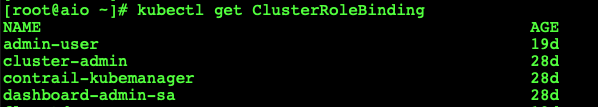
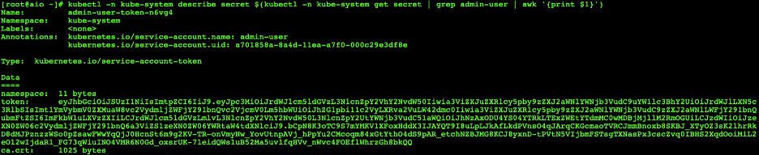

# kubernetes Dashboard
 Kubernetes Dashboard Configuration

Kubernetes dashboard is the official web-based UI for Kubernetes. The dashboard provides an overview of the Kubernetes cluster as well as the individual resources running in it. As such it is an important piece of the Kubernetes puzzle allowing DevOps and Kubernetes administrators to view and manage the monitoring and operational aspects of their Kubernetes clusters

In this lab, I have created a two-tier application Kubernetes orchestration. The lab walks through the process of how one can run the front-end ingesting the HTTP requests inside a Kubernetes cluster to access an application running in the Kubernetes cluster.

Typically, a pod runs the application however this pod is not exposed to outside world to access the internet unless we use the ingress service. The steps in this lab walks through how the frontend and the backend run inside a Kubernetes environment. Later part of this lab ensures to expose the application to the internet over SSL connection, so that the application can be consumed from the internet.

_The pre-requisites for this lab is that I have the k8 cluster up and running. We can download the k8 dashboard manifests by simply following quick steps below._

### Install Kubernetes Dashboard using Kubectl
I assume that you already have a Kubernetes cluster up and running and have installed Kubectl. Deploy the Kubernetes dashboard using Kubectl:

~~~
kubectl create -f https://raw.githubusercontent.com/kubernetes/dashboard/master/aio/deploy/recommended/kubernetes-dashboard.yaml
~~~

Alternatively, we can also deploy the dashboard by saving this yaml code into a file locally and using kubectl create: 

~~~
kubectl create -f kubernetes-dashboard.yaml
~~~

Once we have created the above manifests, we should be able to access the Kubernetes dashboard running in the cluster. We can see that the dashboard pod is running as a deployment at 192.168.1.151

We then have to see what service and external port this pod is exposed too. We can see that as service on the Kubernetes cluster.

We can see that the Kubernetes dashboard is exposed on the port 31605. If everything is configured correctly, we should be able to curl this dashboard from outside. Once you browse the page, you will be promoted to the credential page. This is the page where you have to admin rights to create the token.

You will have to create the admin-user account and the clusterRolebindings for that account. Let's create the necessary manifests.

~~~~~
[root@aio k8-dashboard]# more dashboard-adminuser.yaml 
apiVersion: v1
kind: ServiceAccount
metadata:
  name: admin-user
  namespace: kube-system
~~~~~

~~~~~
[root@aio k8-dashboard]# more admin-role-binding.yml 
apiVersion: rbac.authorization.k8s.io/v1
kind: ClusterRoleBinding
metadata:
  name: admin-user
roleRef:
  apiGroup: rbac.authorization.k8s.io
  kind: ClusterRole
  name: cluster-admin
subjects:
- kind: ServiceAccount
  name: admin-user
  namespace: kube-system
~~~~~

Let's test by curling into the above URL

## Kubernetes Dashboard Authentication
There are two options to authenticate our Kubernetes dashboard account; using either the token or the kubeconfig method. For the purposes of this tutorial, we will use the token authentication method.

Logging into k8 dashboard.

https://192.168.1.151:31605/#!/login

The token authentication method requires us to create a new service account for the Kubernetes dashboard. We will bind this service account to the cluster-admin role, which will give us access to all Kubernetes resources on the dashboard. We can then use the bearer token for the service account to log in to the dashboard.

## Create the dashboard service account

~~~
kubectl create serviceaccount dashboard-admin-sa
~~~
This will create a service account named dashboard-admin-sa in the default namespace

Next bind the dashboard-admin-service-account service account to the cluster-admin role
~~~
kubectl create clusterrolebinding dashboard-admin-sa 
--clusterrole=admin-user --serviceaccount=default:dashboard-admin-sa
~~~

When we created the dashboard-admin-sa service account Kubernetes also created a secret for it.

let's verify the above manifests

Given you have the admin account and secret, you can generate token by running the below command. 

~~~
kubectl -n kube-system describe secret $(kubectl -n kube-system get secret | grep admin-user | awk '{print $1}')
~~~

Copying the token and pasting into the page will launch the K8 dashboard.

once the token is passed to the portal, we should be able to land into the k8 dashboard

You have successfully logged into the k8 dashboard. You can now create, delete and modify the k8 environments.

# happy orchestrating pods and building apps.